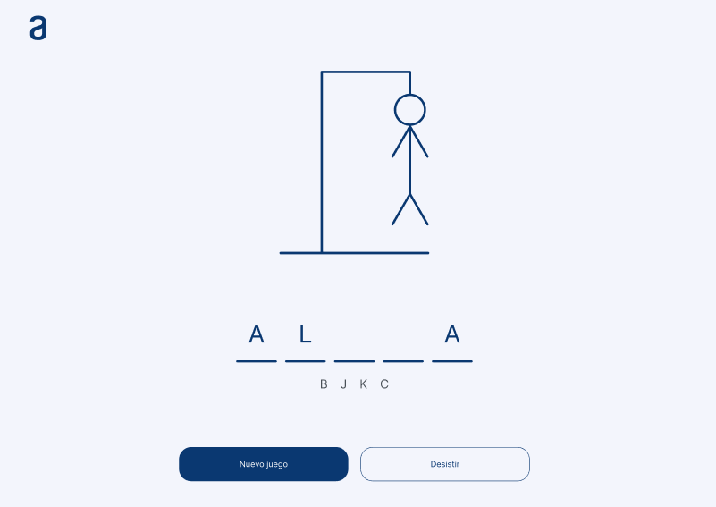

# 🕹️ Juego Ahorcado

Juego Ahorcado para Challange nº2 de Alura Latam - Oracle ONE

## Enlace

https://gonzaloparada.github.io/Juego-Ahorcado-Alura-ONE/

## 💡 Descripción

Este desafío consiste en crear el juego del ahorcado. Se presenta un menú inicial donde se puede elegir entre iniciar el juego o añadir una palabra a la lista.

## ✔️ Requisitos:

- Debe funcionar solo con letras mayúsculas;
- No deben ser utilizadas letras con acentos ni caracteres especiales;
- Al completar o dibujo de la horca, debe ser mostrado un mensaje "Fin del juego" en la pantalla;
- Si se completa la palabra correcta antes de que se acaben los intentos, debe ser mostrado un mensaje de "Ganaste, Felicidades!" en la pantalla.
- La página debe tener los guiones indicando cada letra da palabra, separados por un espacio;
- Para comenzar el juego la página debe tener un botón de "Iniciar Juego";
- No debe ser posible escribir números dentro del juego.
- Las letras equivocadas deben aparecer en la pantalla, pero no pueden aparecer de forma repetida;
- Las letras correctas deben aparecer en la pantalla encima de los guiones, en la posición correcta en relación a la palabra.

**EXTRA**

- La página debe tener un campo para inserción de texto con la finalidad de adicionar nuevas palabras al juego, e un botón "Agregar palabra".
